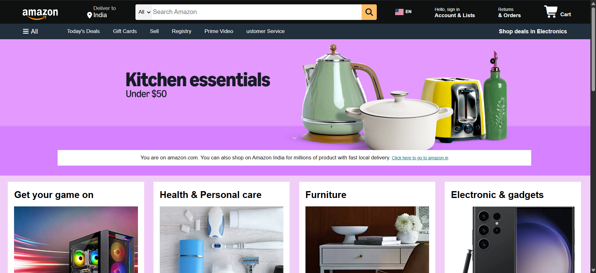

🛒 Amazon Clone

🔗 Live Demo:
https://neelcreates456.github.io/amazon-clone/

---

📌 About The Project

This is a front-end clone of the Amazon homepage built using HTML, CSS, and a bit of JavaScript.
The goal of this project was to practice real-world UI design and improve front-end development skills.

---

🚀 Features

 Navigation bar similar to Amazon
 Hero section with clickable banner
 Product grid layout
 Hover effects for better UI
 Clickable links (redirect to Amazon)
 Basic responsive structure

---

🛠️ Tech Stack

- HTML (55.4%)
- CSS (42.3%)
- JavaScript (2.3%)

---

📂 Project Structure

amazon-clone/

>index.html
>style.css
>new.js
>Hero-image(new).jpg
>box1_image.jpg
>box2_image.jpg
...

---

What I Learned

- Structuring real-world layouts using HTML & CSS
- Working with Flexbox for alignment
- Creating clickable UI elements
- Deploying projects using GitHub Pages
- Managing code using Git & GitHub

---

Deployment

This project is deployed using GitHub Pages.

---

#Screenshots

---

Future Improvements

- Make fully responsive (mobile-friendly)
- Add more JavaScript functionality
- Improve animations & transitions more efficiently
- Add backend features (login/cart)

---

Author
NeelCreates456 
